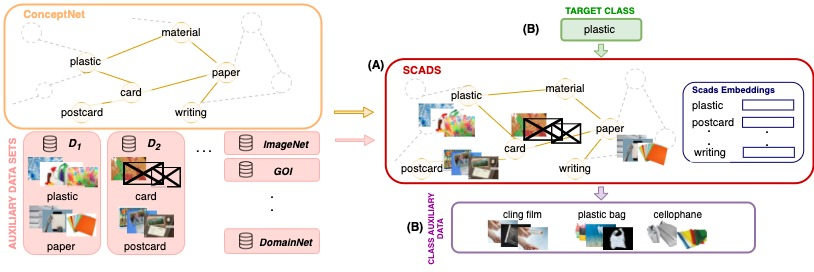

# TAGLETS:  A System for Automatic Semi-Supervised Learning with Auxiliary Data

[](https://travis-ci.com/BatsResearch/taglets)

TAGLETS is a system that automatically and efficiently exploits all available data, including labeled, unlabeled, and auxiliary data, for a given task to produce a single, robust classifier. TAGLETS extracts relevant auxiliary data for training using SCADs, a database of auxiliary data aligned with concepts in ConceptNet, and passes all relevant data to an ensemble of user-specified modules, which are trained and distilled into a final classifier.  


Our paper can be accessed on [arxiv](https://arxiv.org/abs/2111.04798).

## Performance
We evaluate TAGLETS on three image classification datasets: [**Flickr Material database**](https://people.csail.mit.edu/lavanya/fmd.html), [**Office-Home dataset**](https://www.hemanthdv.org/officeHomeDataset.html), and [**Grocery Store dataset**](https://github.com/marcusklasson/GroceryStoreDataset). In our experiments, we vary the number of labeled examples per class from 1 to 20 and treat the remaining training data as unlabeled data. We compare TAGLETS to state-of-the-art transfer and semi-supervised learning methods, all of which use [BigTransfer](https://arxiv.org/abs/1912.11370) (ImageNet-21k) as a pretrained backbone. 

|    Method        | OfficeHome-Product (1-shot)  | OfficeHome-Product (5-shot) | OfficeHome-Clipart (1-shot) | OfficeHome-Clipart (5-shot) |  
|------------------|--------------------|--------------------|--------------------|--------------------|
| Fine-tuning             | 57.28 ± 5.20   |  84.41 ± 1.17 | 30.36 ± 2.54 |  63.44 ± 2.10  | 
| Fine-tuning (distilled) | 58.21 ± 4.56   |  85.03 ± 0.22 | 31.74 ± 1.96 | 62.92 ± 1.99 | 
| FixMatch                | 49.03 ± 2.54   |  83.03 ± 2.97 | 30.67 ± 5.44 | 64.77 ± 1.75  | 
| Meta Pseudo Labels      | 59.95 ± 0.44   |  81.53 ± 1.01 | 31.74 ± 2.10 | 62.92 ± 2.13            |           
| TAGLETS                 | **70.92 ± 1.67** | **86.31 ± 1.01** | **46.97 ± 2.46**  |   **67.64 ± 3.34** |


|    Method        | Grocery Store (1-shot)  | Grocery Store (5-shot) | Flickr Material (1-shot) | Flickr Material (5-shot) |  
|---------------------|--------------------|--------------------|--------------------|--------------------|
| Fine-tuning             |  51.32 ± 3.23   |  85.16 ± 2.41 | 52.67 ± 2.35 | 70.07 ± 1.52  | 
| Fine-tuning (distilled) | 52.42 ± 1.03   | 86.06 ± 1.81| 57.53 ± 10.95 | 73.27 ± 1.03 | 
| FixMatch                |  48.58 ± 13.41   | 87.61 ± 4.82 | 19.07 ± 31.91 | 60.67 ± 5.03  | 
| Meta Pseudo Labels      | 54.51 ± 6.22   |   84.02 ± 1.30 | 52.73 ± 5.82 | 69.80 ± 2.24           |           
| TAGLETS                 | **61.60 ± 2.90** | **88.91 ± 1.07** | **68.07 ± 5.76**  |   **75.20 ± 1.72** |

In the few-shot setting, TAGLETS outperforms existing semi-supervised and transfer learning methods in all datasets and matches the performance of these methods in the mid-shot regime. See **Section 4** of our [paper](https://arxiv.org/abs/2111.04798) for more fine-grained results and an ablation study. 

## Installation

The package requires `python3.7`. You first need to clone this repository:
```
git clone https://github.com/BatsResearch/taglets.git
```

Before installing TAGLETS, we recommend creating and activating a new virtual environment which can be done by the following script:
```
python -m venv taglets_venv
source taglets_venv/bin/activate
```

You also want to make sure `pip` is up-to-date:
```
pip install --upgrade pip
```

Then, to install TAGLETS and download related files, run:
```
bash setup.sh
```


## Solve a task (with limited labeled data) with TAGLETS

For this demo, we will solve CIFAR-10 with only 0.1% of the available training data. First, we download and setup the required auxiliary data. Then, we provide instructions on how to run the demo with the auxiliary data. Finally, we describe optional gpu/multi-gpu setup to run the experiments. 

### 1. Set up the auxiliary data
For this task, we will use use CIFAR-100 as our auxilliary dataset. We will download CIFAR-100 and the SCADS file corresponding to CIFAR-100 by running the below bash script in the outermost directory of TAGLETS.

```
mkdir aux_data
cd aux_data
wget -nc https://storage.googleapis.com/taglets-public/cifar100.zip
unzip cifar100.zip
rm cifar100.zip
cd ../predefined
wget -nc https://storage.googleapis.com/taglets-public/scads.cifar100.sqlite3
cd embeddings
wget -nc https://storage.googleapis.com/taglets-public/embeddings/cifar100_processed_numberbatch.h5
```
### 2. Run the task

Run the demo using the `run_demo.py` file (shown below). We recommend using GPUs to run the scrip. It takes around two hours to run the script on one NVIDIA V100s.


For GPU/Multi-GPU support, we need to add the argument `--use_gpu` when launching the script and also use `accelerate launcher` to launch the script.
Please read the instructions on how to launch the python script in [this](#multigpus) section. 

```python
import argparse
import numpy as np
import torch.nn as nn
from torch.utils.data import Subset, Dataset
from torchvision.datasets import CIFAR10
import torchvision.models as models
import torchvision.transforms as transforms
import torch
torch.set_deterministic(True)

from taglets import Controller
from taglets.scads import Scads
from taglets.task import Task
from taglets.task.utils import labels_to_concept_ids
from taglets.modules import MultiTaskModule, ZSLKGModule, TransferModule

# from taglets.models import bit_backbone

parser = argparse.ArgumentParser()
parser.add_argument('--use_gpu', action='store_true', help='should have this flag if you use gpu(s)')
args = parser.parse_args()

# This if statement will be executed if the argument --use_gpu is set.
# If you use gpu(s), please make use to set the argument --use_gpu
if args.use_gpu:
    import random
    from accelerate import Accelerator
    accelerator = Accelerator()
    # We want to avoid non-deterministic behavoirs in our multi-GPU code
    random.seed(0)
    np.random.seed(0)
    # If multiple processes try to download CIFAR10 to the filesytem at once, you might get an error
    # So we modify the code to download the dataset only in the main process
    if accelerator.is_local_main_process:
        _ = CIFAR10('.', train=True, download=True)
        _ = CIFAR10('.', train=False, download=True)
    accelerator.wait_for_everyone()

# ---------------- Setting up an example task with limited labeled data ---------------
# This example task is CIFAR10, but only 0.1% of the training data is labeled.
# The rest of the training data is used as unlabeled examples.

data_mean = [0.485, 0.456, 0.406]
data_std = [0.229, 0.224, 0.225]
train_transform = transforms.Compose([
    transforms.RandomResizedCrop((224, 224), scale=(0.8, 1.0)),
    transforms.RandomHorizontalFlip(),
    transforms.ToTensor(),
    transforms.Normalize(mean=data_mean, std=data_std)
])
test_transform = transforms.Compose([
    transforms.Resize((224, 224)),
    transforms.ToTensor(),
    transforms.Normalize(mean=data_mean, std=data_std)
])
train_dataset = CIFAR10('.', train=True, transform=train_transform, download=True)
test_dataset = CIFAR10('.', train=True, transform=test_transform, download=True)

labeled_percent = 0.001
num_train_data = 50000
indices = list(range(num_train_data))
train_split = int(np.floor(labeled_percent * num_train_data))
np.random.shuffle(indices)
labeled_idx = indices[:train_split]
unlabeled_idx = indices[train_split:]
labeled_dataset = Subset(train_dataset, labeled_idx)
unlabeled_dataset = Subset(train_dataset, unlabeled_idx)

# Make sure TAGLETS will not see the labels of unlabeled data
class HiddenLabelDataset(Dataset):
    """
    Wraps a labeled dataset so that it appears unlabeled
    """
    def __init__(self, dataset):
        self.subset = dataset
        self.dataset = self.subset.dataset

    def __getitem__(self, idx):
        data = self.subset[idx]
        try:
            img1, img2, _ = data
            return img1, img2

        except ValueError:
            return data[0]

    def __len__(self):
        return len(self.subset)
unlabeled_dataset = HiddenLabelDataset(unlabeled_dataset)

class_names = ['airplane', 'automobile', 'bird', 'cat', 'deer', 'dog', 'frog',
               'horse', 'ship', 'truck']
# You can either use our utility function to automatically map class names to concepts,
# Or you can do it manually
concepts = labels_to_concept_ids(class_names)

# --------------------------------------------------------------------------------------

# Set the path where your auxiliary datasets are at
Scads.set_root_path('aux_data')

# Choose your backbone - we support ResNet50 and Bit-ResNet50v2
initial_model = models.resnet50(pretrained=True)
initial_model.fc = nn.Identity()
# We provide BigTransfer using resnet50v2 pre-trained on ImageNet-21k:
# initial_model = bit_backbone()

# Configure your Task instance
# SCADS and SCADS Embeddings files for the setup of SCADS used in the paper (ConceptNet + ImageNet21k)
# is automatically downloaded when you install and set up TAGLETS
scads_path = 'predefined/scads.cifar100.sqlite3' # Path to SCADS file
scads_embedding_path = 'predefined/embeddings/numberbatch-en19.08.txt.gz' # Path to SCADS Embedding file
# Optional (for faster computation): path to processed SCADS Embedding file where all embeddings of nodes without images are removed
processed_scads_embedding_path='predefined/embeddings/cifar100_processed_numberbatch.h5'

task = Task('limited-labeled-cifar10', # Task name
            concepts, # Target concepts
            (224, 224), # Image size
            labeled_dataset, # Training labeled data
            unlabeled_dataset, # Training unlabeled data
            None, # Validation dataset
            32, # Batch size
            scads_path=scads_path, # Path to the SCADS file
            scads_embedding_path=scads_embedding_path, # Path to the SCADS Embeddings file
            processed_scads_embedding_path=processed_scads_embedding_path, # (Optional) Path to
            # the processed SCADS Embeddings file where the nodes without any auxiliary images are pruned
            wanted_num_related_class=3) # Num of auxiliary classes per target class
task.set_initial_model(initial_model)
task.set_model_type('resnet50') # or 'bigtransfer'

# Pick the training modules
modules = [MultiTaskModule, ZSLKGModule, TransferModule]

# Use the Task instance to create a Controller
# Then, use the Controller to get a trained end model, ready to do prediction
controller = Controller(task, modules=modules)
end_model = controller.train_end_model()

# Use the trained end model to get predictions
outputs, _ = end_model.predict(test_dataset)
predictions = np.argmax(outputs, 1)

# Or get the end model's accuracy on the test data
print(f'Accuracy on the test data = {end_model.evaluate(test_dataset)}')
```

## GPU/Multi-GPU Support <a name="multigpus"></a>

TAGLETS uses the package `accelerate` to support the use of one or more GPUs. You need to use the `accelerate launcher` to run the script in order to use GPUs. 

Suppose you want to use 4 GPUs. Your config file, e.g., `acclerate_config.yml`, should look similar to this:
```yml
compute_environment: LOCAL_MACHINE
distributed_type: MULTI_GPU
fp16: false
machine_rank: 0
main_process_ip: null
main_process_port: null
main_training_function: main
num_machines: 1
num_processes: 4 # set this number to the number of gpus
```

Then, you can run the launcher as following:
```
accelerate launch --config_file accelerate_config.yml run_demo.py --use_gpu
```
where `run_demo.py` contains your python script using TAGLETS

One important thing to note of `accelerate` is it spawns multiple processes running the same python script, so as with other multiprocessing code, you need to keep in mind the usual parallelization caveats. These include but not limited to:

- Make sure the script is deterministic across processes
- When saving or loading files, make sure all processes are joined before doing so
- When interacting with an external server, might want to only do that only in the main process to avoid duplicate requests

We recommend reading more about `accelerate` before you try to use multiple gpus: https://huggingface.co/docs/accelerate/ 

## Customize SCADs

One main component of TAGLETS is its Structured Collection of Annotated Datasets, or SCADs. 

In the previous example, we assume SCADs to be composed of ImageNet-21k installed on top of [ConceptNet](https://conceptnet.io/). 
But the original idea of SCADs is to gather all the datasets, public accessible or available to internal organization, that can be helpful to learn the novel target task.

Here we show you how to fully exploit the potential of a SCADs by introducing how new annotated datasets can be installed on top of ConceptNet.




Conceptually, to install a new dataset in SCADs means to:

1. Align the dataset's categories to nodes (or concepts) in ConceptNets.
2. Associate categories' images to the corresponding concepts.

To download SCADs sqlite file with no datasets installed, you can run the following script:
```
mv predefined 
wget -nc https://storage.googleapis.com/taglets-public/scads.nodataset.sqlite3
```

Practically, to install a new dataset, we proceed as follows.

1. In `taglets/taglets/scads/create/intall.py`, define a subclass of `ImageClassificationInstaller` that at least:
    - Get the name of the new dataset (`get_name()`).
    ```python
    def get_name(self):
        return "New dataset"
    ```
    - Rename dataset's categories to handle string mismatch with the corresponding concept. In particular you can specify a dictionary to resolve the names conflicts between your categories' names and SCADs nodes (`get_conceptnet_id(label)`).
    ```python
    def get_conceptnet_id(self, label):
        label_to_label = {1: 'person', 2: 'bicycle', 
                          3: 'car', 4: 'motorcycle',
                          5: 'airplane', 6: 'bus'
                          }

        return "/c/en/" + label_to_label[label].lower().replace(" ", "_").replace("-", "_")
    ```
    or
    ```python
    def get_conceptnet_id(self, label):
        exceptions = {'paint_can': 'can_of_paint',
                      'The_Eiffel_Tower': 'eiffel_tower',
                      'animal_migration': 'migration'
                      }
        
        if label in exceptions:
            return "/c/en/" + exceptions[label]
        return "/c/en/" + label.lower().replace(" ", "_").replace("-", "_")
    ```
    - Add each image inthe dataset to its corresponding concept in the knowledge graph (`get_data(dataset, session, root)`).  
    ```python
    def get_data(self, dataset, session, root):
        # Initialize the list of images
        all_images = []
        
        # Loop over the new dataset's categories 
        for label in categories:
            # Get the the node in SCADs corresponding
            # to the image's label
            node = session.query(Node)\
                   .filter_by(conceptnet_id=self.get_conceptnet_id(label))\
                   .first()

            node_id = node.id if node else None
            if not node_id:
                continue
            # If node exists, iterate through the category's images
            for image in os.listdir('path to where labeled images are stored')):
                img = Image(dataset_id=dataset.id, # dataset is an instance to find in install.py
                            node_id=node_id, # node in SCADs extracted above
                            path='path to the image'))
                all_images.append(img)
        return all_images
    ```
    
  
  In the same file, you can find several examples of `ImageClassificationInstaller` subclasses that you can refer to.


2. Make sure that [here](https://github.com/BatsResearch/taglets/blob/general_system/taglets/scads/create/install.py#L420) and [here](https://github.com/BatsResearch/taglets/blob/general_system/taglets/scads/create/install.py#L461) you add your dataset to properly install it.


3. Install the dataset. To update the current version of SCADs:
    
    - Place yourself in the root folder and run 
    
    ```
    python -m taglets.scads.create.install --db predefined/<current scads> --root <dataset root folder>  --newdata <name>
    ```

4. Update the list of concepts to consider while looking for target-related auxiliary data (i.e., only the concepts corresponding to images).
    - Add [here](https://github.com/BatsResearch/taglets/blob/general_system/taglets/scads/interface/scads_embedding.py#L267) the following line of code 
    ```
    process_embeddings()
    ```
    - To update the file `predefined/embeddings/processed_numberbatch.h5`, place yourself in the root folder and run
    ```
    python -m taglets.scads.interface.scadsembedding
    ```
    
## Citation

Please cite the following paper if you are using our framework :)

```
@inproceedings{piriyakulkij:mlsys22,
  Author = {Wasu Piriyakulkij and Cristina Menghini and Ross Briden and Nihal V. Nayak and Jeffrey Zhu and Elaheh Raisi and Stephen H. Bach},
  Title = {{TAGLETS}: {A} System for Automatic Semi-Supervised Learning with Auxiliary Data},
  Booktitle = {Conference on Machine Learning and Systems (MLSys)},
  Year = {2022}}
```